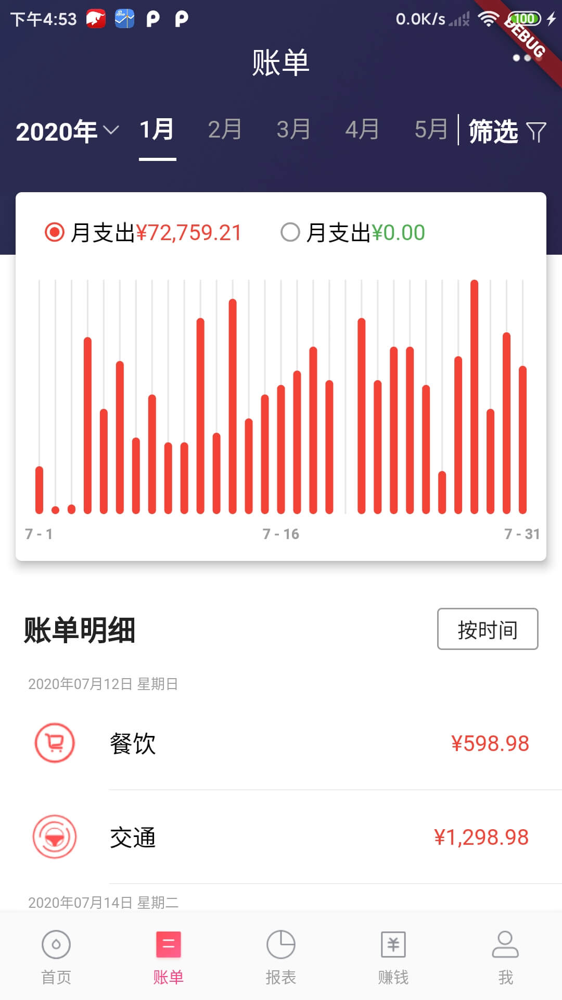
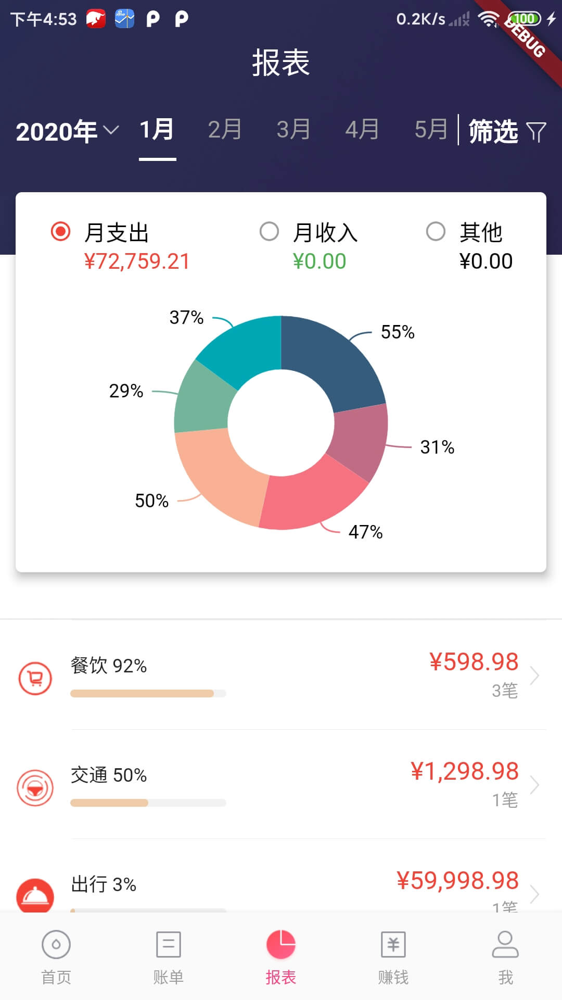

# flutterproject

> 2019年 , 我认识了Flutter , 但那时只是 尝鲜 , 使用了一些简单的 组件,画了一些简单的页面. 后面就没怎么在鼓捣了. 最近公司有意向要做混合开发 , 然后我就自告奋勇,然后就开始了Flutter的学习 . 正好赶上一个做后端开发的兄弟,在使用的一款 记账APP  **(网易有钱记账)** 不维护了, 他一直在使用这个APP , 然后我就跟他说,我给你做个. 然后就照着  **(网易有钱记账)**  APP 的样子,开始使用 Flutter 写APP,

**先放出已经实现差不多的效果图**

## 总结下项目中使用到的 一些开源库

> 写到现在深深的觉得自己是多么的菜. 难 , 难 , 难 . Flutter 发展 到现在, 涌现出很多优秀的开源库, 作为一个萌新,在这方面 根据以往的Android开发经历, 选择一个 高质量 / 符合项目需求的,高定制化的 库 很难. **(主要还是菜.)** , 这个项目  **90% 以上是使用Flutter原生组件 ,以及 原生组件组合使用 完成目标效果.** 

- **fluro** : 路由框架
- **fluttertoast** : 吐司 
- **dio** : 网路请求相关
- **shared_preferences** : 本地存储
- **flutter_swiper** : 轮播图
- **pull_to_refresh** : 刷新/加载
- **fl_chart** : 图表, **这里只用在账单页面**
- **syncfusion_flutter_charts** : 项目里饼状图 用的是这个库.

以上就是在项目中用到的开源库.

### 项目中需要优化的部分

- 使用 **pull_to_refresh** 进行自定义刷新头的时候, **CustomScrollView**  回弹 刷新头  不固定问题. 
- 首页 / 账单 / 报表 页面状态管理, 以及 筛选 / 支出 / 收入 等 状态. 暂定使用 **provider**  
- 使用封装的 **dio库** 进行网络请求, 缓存到本地 , 以及结合 状态管理 进行页面重新渲染.
- 适配问题,项目有部分布局是进行了适配的 , 但是在别的 手机上还是有很多 不一样的表现形式. 目前暂定 先使用这个 **flutter_screenutil** .
- 应用在 iOS 模拟器上面 运行卡顿 , 难受.  准备研究一下这个 (https://flutter-io.cn/docs/testing/ui-performance) , 好好 改改.
- 组件的常用属性进行抽取 , 比如 **Text # TextStyle**   **Color**  **SizedBox**  **String 字符串**  等等...

以上便算是解决了 **有没有的问题**

这里的有没有在我看来是有两个方面的:

1. **Flutter 从 0 到 1**
2. **项目 从 0 到 1**

解决了有没有的问题,才能跟好的研究 好不好的问题.接下来会把项目在更近一步的优化 ,  争取不被别人拉开太远距离 . 

**掉皮,掉肉,不掉队.**

**流血,流汗,不流泪** 

# -----------第一版本 end------------

### 结下来准备做的.

- 第一版本 优化部分.
- 剩余功能 , 
- 操作数据库相关. 实现 记账 记录本地存储 ,
- 性能相关的了解,引擎, 以及运行机制,原理等...
- 阅读源码 ,  了解实现思路 , 尝试自定义 组件.
- 尝试写个开源库...

